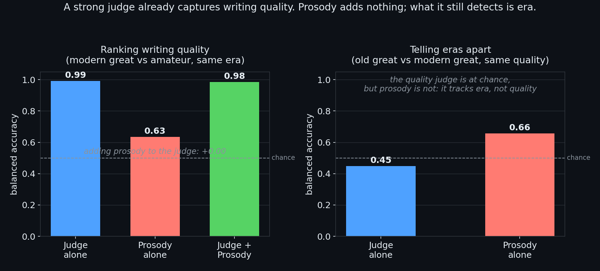

# What we learned trying to teach a machine the rhythm of good writing

## The intuition

Language models improved fastest where success is checkable. A math answer is right or wrong; code passes its tests or fails them. Writing has no such checker. The usual substitute is to ask another model to score quality, but those judges drift toward bland, formulaic prose, the kind people call "slop." We wanted a quality signal that was real, cheap to compute, and hard to fake.

Our candidate was prosody: the rhythm of prose. When you read silently you still "hear" a cadence: stresses, pauses, and phrasing. Linguists call this implicit prosody. Our bet was that skilled writing has a controlled rhythmic variation that flat machine writing lacks, and that a word-counting model would be deaf to it. If true, it could become one term in a writing reward.

## How we measured it, carefully

We turned each passage into prosody features: syllable counts, lexical stress patterns from a pronunciation dictionary, sentence-length variation, and clause boundaries. The danger with any signal like this is fooling yourself, so we built guardrails. We used group-aware cross-validation, meaning the same book or model never sat in both the training and the test set, so a classifier could not cheat by memorizing a source. We never reported raw accuracy; we reported the increment a feature added over a strong baseline. And we fixed the kill criterion before each run, so a negative could not be explained away afterward.

## The experiments, one after another

The first runs were encouraging. Prosody separated acknowledged-great prose from AI slop well above chance, and against a pure lexical "slop" baseline it still added a real, statistically significant lift, about +0.10 in balanced accuracy on the within-human contrast. Promising, but that contrast mixed quality with era and register: old classics versus modern amateurs. That left a question we kept returning to: is the signal genuinely weak, or are we just extracting it crudely?

So we attacked the extraction. We added order-aware features, asking whether the rhythm trends or repeats across a passage. They added nothing beyond the simple summary statistics. We checked whether our features matched real human reading, using a corpus of EEG and eye-tracking recordings. They predicted reading time slightly, but the distinctly prosodic parts, phrase boundaries and brain rhythm, came back null. We tested prosody as an AI-text detector that survives paraphrasing: it held against weaker models but its edge nearly vanished against GPT-4o, whose rhythm is already human-like. Finally we swapped the dictionary stress for a speech-grounded model that predicts per-word prominence. It barely moved the result, giving only a borderline lift on quality.

## The decisive test

Every experiment so far compared prosody against simple word-level baselines. But a real reward model would use a strong judge. So we asked the question that mattered: does prosody add anything on top of a capable judge?

We had a frontier model rate writing quality, but carefully. We stripped every label and shuffled the passages so the judge saw only anonymized text, never knowing which was great or amateur, and never seeing words like rhythm that could tip it off. We scored each passage twice and averaged. We even ran an adversarial review of our own code before looking at any result, which caught two genuine bugs.

The judge separated modern great writing from modern amateur writing almost perfectly, an area-under-curve of 1.0. Adding prosody changed nothing: the increment was effectively zero, and once we statistically removed the judge's opinion, prosody fell below chance. A control sealed it. The judge could not tell old great prose from modern great prose, since both are high quality, but prosody could. So what prosody still carried was period and register, not quality.

## What we conclude

Text-derived prosody is real, but for ranking writing quality it is redundant once a capable judge is present. The judge already captures what prosody offered, and the remainder is era and style. This is a clean negative, and clean negatives are findings, not failures.

The durable result was the method: confound control, honest baselines, criteria fixed in advance, and auditing ourselves before trusting any number. Next we run discourse coherence, how text holds together across sentences, through the same gauntlet. We also shift the real effort toward a reward that preserves diversity, rather than collapsing every model toward one safe voice.

*Figure: the crux result. Left, ranking modern great writing against amateur writing, the judge is near-perfect and prosody adds nothing on top. Right, the era control, where the quality judge sits at chance but prosody does not, so prosody tracks era rather than quality.*

## Where to dig deeper (repository paths)

- `src/experiments/crux_eval.py`: the decisive analysis (judge alone vs judge plus prosody, with the era control)
- `src/judge/judge_prep.py`, `src/judge/judge_score.py`, `src/judge/judge_collect.py`: the blind, anonymized LLM-judge pipeline
- `src/evaluate.py` and `src/features_lib.py`: the shared evaluation gauntlet and the prosody features themselves
- `docs/FINDINGS.md`: every finding from F1 to F8 with its evidence and limits
- `docs/SYNTHESIS.md`: the whole arc in one read; `docs/EXPERIMENT_LOG.md`: dated runs and pre-registrations
- `docs/RELATED_WORK.md`: how this sits against published work (DivPO, LongWriter-Zero, DARLING)
- `figures/crux_result.png`: the figure above, generated by `src/experiments/plot_crux.py`
